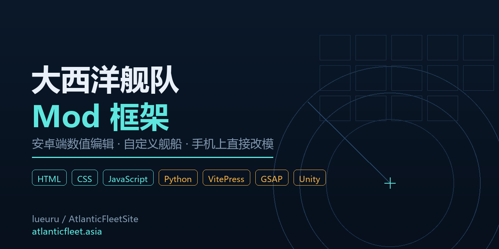

<div align="center">



# 大西洋舰队 · Mod 框架

**让玩家在手机上直接改《大西洋舰队》的数值、舰船与模型 —— 不用连电脑、不写代码、不需要 Root。**

[](https://atlanticfleet.asia)
[](https://github.com/lueuru/AtlanticFleetSite/graphs/contributors)
[](https://github.com/lueuru/AtlanticFleetSite/graphs/contributors)
[](https://github.com/lueuru/AtlanticFleetSite)

[🌐 打开网站](https://atlanticfleet.asia) · [📖 读文档](https://atlanticfleet.asia/docs/) · [🎮 Mod 仓库](https://atlanticfleet.asia/mods/) · [🐛 提问题](https://github.com/lueuru/AtlanticFleetSite/issues)

</div>

---

## 📌 这是什么

一套**运行在玩家手机里**的《大西洋舰队》Mod 框架。用户不用连电脑、不写代码、不装 Root，
装上之后就能在手机上调数值、加自己的舰船、装别人做的模型与贴图。

<div align="center">

| 🎯 面向终端用户 | 📖 65 页完整文档 | 📦 社区 Mod 仓库 | 🌐 双重托管 |
|:---:|:---:|:---:|:---:|
| 普通玩家手机完成<br>全部操作 | 安装到改模<br>逐页图文 | 浏览 · 登记<br>下载 · 站外链接 | 自建服务器 +<br>GitHub 副本兜底 |

</div>

> **本仓库是什么 / 不是什么**
>
> ✅ **是** —— 已构建好的静态网站（官网 + 文档 + Mod 仓库），可直接部署。
> ❌ **不是** —— Mod 框架的 C# 源码、APK 构建脚本、汉化工程。**那些是私人工程，尚未开源。**
>
> **为什么单独发一份？** 主站 `atlanticfleet.asia` 是单机无冗余。这份副本托管在 GitHub 上，
> 域名过期、机器故障、停机迁移期间，**文档和 Mod 列表仍可访问**。
> 副本是**只读**的：上传、审核、删除等写操作只在主站提供 ——
> 留一个点下去必然失败的表单，比没有更糟。

---

## 🛠 技术栈

<div align="center">


</div>

<div align="center">

**前端** 原生 HTML/CSS/JS，无框架依赖，零构建即可运行 　|　 **文档** VitePress 1.6 静态站点
　 **动效** GSAP + ScrollTrigger + Lenis 　|　 **后端** Python 标准库（零第三方依赖）
　 **托管** Windows Server + Nginx 反向代理

</div>

---

## 💼 精选项目

### 大西洋舰队 Mod 框架 · 官网与文档

<div align="center">

| 🏗️ 架构 | 🔒 后端 | 🎨 主题 | 📦 内容 |
|:---:|:---:|:---:|:---:|
| **三层解耦**<br>主站 → 副本 | **零依赖**<br>Python 标准库 | **令牌化**<br>深浅色自适应 | **65 页**<br>文档 + 仓库 |

</div>

| 模块 | 说明 | 入口 |
|---|---|---|
| **官网首页** | 单屏 hero，功能入口分流 | [`/`](/) |
| **使用文档** | 安装部署 · 日常操作 · 原理 · FAQ · 术语表 | [`/docs/`](/docs/) |
| **Mod 仓库** | 浏览、登记、下载，支持站外链接 | [`/mods/`](/mods/) |
| **审核后台** | 上传审核 · URL 白名单 · 日志审计 | [`/admin/`](/admin/) |
| **架构说明** | 目录结构、构建流程、部署方式 | [`/docs/architecture/`](/docs/architecture/) |

<div align="center">

**[🌐 访问线上站点 →](https://atlanticfleet.asia)** 　·　 **仓库规模：309 个文件 · 15,933 行代码**

</div>

---

## 📊 动态数据

<div align="center">

### 仓库实时指标


### 语言分布


### 贡献曲线


</div>

<div align="center">
  <sub><i>↑ 以上全部由 GitHub 官方 <code>shields.io</code> 徽章端点根据仓库实时数据生成，<br>无需手动更新，每次打开仓库自动刷新</i></sub>
</div>

---

## 📝 最近动态

<div align="center">

| 版本 | 内容 | 日期 |
|:---:|---|:---:|
| **v2.54** | 汉堡菜单去重与标题修复 · 全站联系方式补齐 | 2026-10-07 |
| **v2.53** | 后台写操作统一收口 · 密码守卫修复 | 2026-10-07 |
| **v2.52** | 副本同步前快照 | 2026-10-07 |
| **v2.46** | 全站图标统一 · 社区入口集中管理 | 2026-10-06 |
| **v2.45** | 视觉与交互落地：液态玻璃 · 层级令牌化 | 2026-10-06 |

</div>

**最新一版修掉了什么**

- 修复菜单标题读取截断导致的 **29 项重名**（14 项曾全叫「怎么用」）
- 修复去重键含不可见字符导致的**整组重复列表**
- 全站 **7 个页面**补齐 QQ / B站 / GitHub 入口（含 404 页）
- 新增 **502 自愈**：外部探活每分钟巡检，后端崩溃后自动拉起

<details>
<summary><b>📦 全部公开仓库</b></summary>

| 仓库 | 说明 | 语言 |
|---|---|---|
| [`AtlanticFleetSite`](https://github.com/lueuru/AtlanticFleetSite) | Mod 框架官网 · 文档 · 仓库 | HTML |
| [`Xinbi`](https://github.com/lueuru/Xinbi) | 文学社 | — |
| [`SPA`](https://github.com/lueuru/SPA) | — | — |
| [`xinbi-literature.github.io`](https://github.com/lueuru/xinbi-literature.github.io) | 文学社站点 | — |

</details>

---

## 🤝 参与贡献

<details>
<summary><b>点击展开：提 Issue / 提 PR 的具体做法</b></summary>

**报告问题**：[新建 Issue](https://github.com/lueuru/AtlanticFleetSite/issues/new)
请附上：访问的页面地址、浏览器与设备、复现步骤、报错截图。

**提交改动**：

```bash
git clone https://github.com/lueuru/AtlanticFleetSite.git
cd AtlanticFleetSite
git checkout -b feat/your-change
# ... 修改后自测：起本地服务  python _serve.py 8000
git commit -m "feat: 你的改动说明"
git push origin feat/your-change
```

然后在 GitHub 上发起 Pull Request。

**适合贡献的方向**

- 📖 文档错漏、表述不清、步骤过时
- 🐛 移动端布局错位、深浅色对比度问题
- ♿ 键盘导航、屏幕阅读器可访问性问题
- 🌍 英文 / 日文等译文

> **注意**：本仓库是主站的只读副本，**功能性改动请先在
> [atlanticfleet.asia](https://atlanticfleet.asia) 验证**。
> Mod 框架的 C# 源码尚未开源，暂不接受相关 PR。

</details>

---

## 📬 联系方式

<div align="center">

[](https://qm.qq.com/cgi-bin/qm/qr?group_code=957336473)
[](https://space.bilibili.com/434094293)
[](https://github.com/lueuru)
[](https://atlanticfleet.asia)

</div>

<div align="center">

| 渠道 | 用途 |
|:---:|---|
| **QQ 群 957336473** | 主要交流 · Mod 求购 · 问题反馈 |
| **B站 @uruban** | 开发日志 · 版本更新预告 |
| **GitHub Issues** | Bug 报告 · 技术讨论 |
| **[atlanticfleet.asia](https://atlanticfleet.asia)** | 文档 · 下载 · Mod 仓库 |

</div>

---

## 📄 许可证与致谢

本仓库的**文档、样式脚本与站点素材**由 [uruban](https://github.com/lueuru) 维护。
《大西洋舰队》及其原始美术资源版权归原作者所有，**本仓库不含任何游戏原始资源**。

**第三方组件**（均已本地化托管，不走 CDN）

| 组件 | 用途 | 许可证 |
|---|---|---|
| [GSAP](https://gsap.com) | 动效引擎 | GreenSock 标准版 |
| [Lenis](https://github.com/darkroomengineering/lenis) | 平滑滚动 | MIT |
| [VitePress](https://vitepress.dev) | 文档构建 | MIT |

---

<div align="center">

**[⬆ 返回顶部](#大西洋舰队--mod-框架)**

<sub>Made with ⚓ by <a href="https://github.com/lueuru">uruban</a> · <a href="https://atlanticfleet.asia">atlanticfleet.asia</a></sub>

</div>
